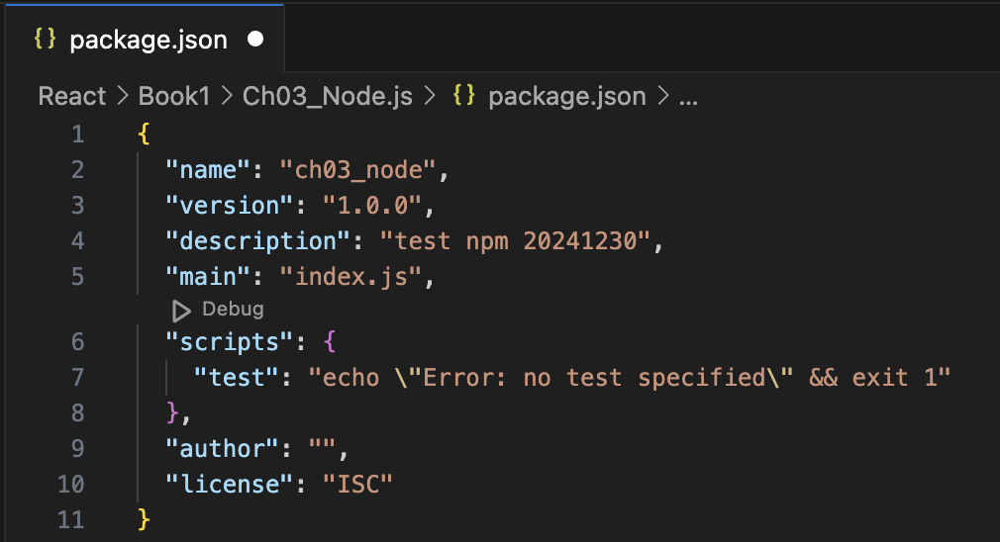

# Chapter 03: Node.js

## Node.js 란? 
- Javascript Runtime Environment 

## 설치 방법
- 이하 생략 

## npm (node package manager)
- 여러 파일을 하나의 파일처럼 관리해주는 단위 
- 최상위 폴더인 '루트 폴더' 존재 
- 패키지 만들기 
    1. 'npm init' 명령어 입력 
        + node package manager 초기화 명령어 
        + 최소한의 구성요소 자동 생성 
    2. 명령어 입력 후, page 이름, 버전, 등 필요사항에 대한 내용 및 확인(Enter Key) 입력 
        + 'Is This Ok?' 에 대한 질문에 대하여 'Enter' Key 입력하면 패키지 초기화 완료됨 
        + 초기화가 완료되면, 'package.json'이라는 파일이 생성되어 있음 
    3. 'package.json'  
        * 구성 항목 
            + name: 패키지 이름 
            + version: 패키지 버전 
            + description: 패키지 설명 (보통 패키지를 구성한 프로그램 관련 설명을 작성) 
            + main: 패키지의 소스 코드 파일 중 메인 역할을 담당하는 소스 코드 파일 
            + scripts: 패키지를 쉽게 다루기 위해 지정한 매크로 명령어 
                + ex. 'npm run start': package.json 파일의 'script' key의 data에서 'start'라는 항목을 찾아서 해당 명령어 실행 
            + author: 패키지를 만든 사람 
            + license: 패키지의 라이선스 
        * 예시 
            

## Module System
- 독립적으로 존재하는 프로그램의 일부
- 재사용 가능
- 예시: In 쇼핑몰 웹 사이트 -> 로그인, 장바구니, 상품 구매 기능, 등
- ES Module System
    * ECMAScript (ESM)
    * 가장 최근에 개발된 모듈 시스템
    * React, Vue 등의 최신 프론트엔드에서 해당 기술이 채택되어 사용되는 중
    * 설정 방법:
        + Node.js: 기본적으로 CJS 모듈 시스템 사용
        + ESM 사용을 위해 'package.json'에서 설정 변경 필요 (변경 안 하고 사용 시 Error 발생!)
        + '"type": "module"' 항목 추가 
        + 예시 
- Import / Export
    * 하나의 모듈에서 data(변수, 함수)를 불러오거나 내보낼 때 사용
    * Import (불러오기)
        + 형식(일부): 'import {data...} from "filename"
        + 형식(전부): 'import * as A from B'
            + B에 있는 데이터를 전부 불러올 수 있음
            + A.(data) 형식으로 데이터에 접근 가능
    * Export (내보내기)
        + 형식: 내보내고자 하는 변수 혹은 함수 앞에 'export' 표시 
        + 'default': 모듈의 기본값으로 내보낼 때 사용
    * 예시: 'circle.js' 및 'index.js'의 Example 02 참조

## Library (라이브러리) 
- node.js 패키지 이외의 외부 패키지s
- 프로그램을 개발할 때 공통으로 사용할 수 있는 기능들을 모아 모듈화 한 것 
- Reference: https://www.npmjs.com 
    + 전 세계 개발자들이 만든 라이브러리가 등록되어 있음 
    + 오픈 소스 
    + 설치 방법:
        + 해당 URL에 접속하여 원하는 라이브러리를 선택
        + 선택한 라이브러리의 설치 명령어를 입력하여 설치 
        + 명령어를 입력하면 해당 웹사이트에서 패키지를 불러와서 자동으로 설치함
        + 섩치과 완료되면 'node_modules'폴더와 'package.json' 및 'package-lock.json'의 'dependencies'항목에 해당 패키지 관련 내용이 추가되어 있음. 
- 라이브러리 재설치 
    + 'node_modules' 
        + 외부 라이브러리가 실제로 설치되는 곳 
        + 가장 용량이 큼
        + 보통 어디에 올리거나 공유할 때, 해당 폴더를 제외하고 올림
        + 해당 프로젝트(패키지)를 공유받은 사람은 해당 폴더가 없으므로 라이브러리 사용이 어려움
        + 이 때 'npm install'명령어를 사용하면 'package.json' 및 'package-lock.json' 파일에 들어있는 내용을 토대로 라이브러리를 설치하게 됨
        + 따라서 두 파일의 보존이 매우 중요  